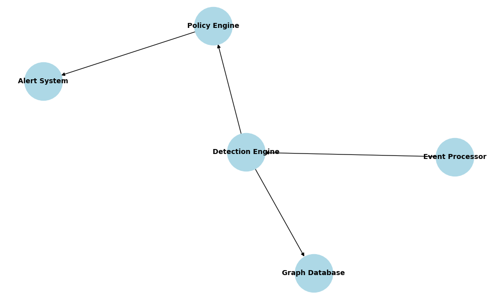
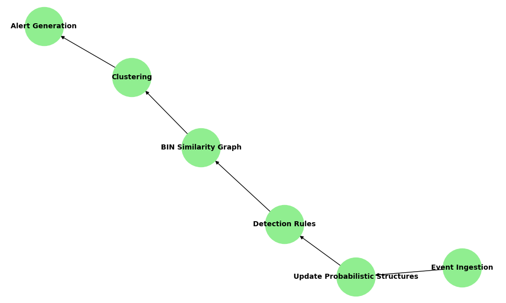
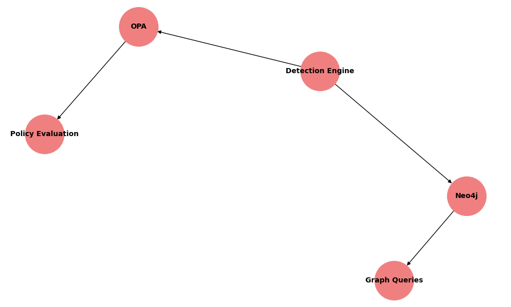

# BIN-Attack-Detection-System

## Overview
The BIN-Attack-Detection-System is designed to detect coordinated enumeration attacks on Bank Identification Numbers (BINs). It leverages probabilistic data structures, graph-based clustering, and policy-based decision-making to identify suspicious patterns and generate alerts.

## Key Features
- **Probabilistic Data Structures**: Utilizes Bloom Filters, Count-Min Sketch, and MinHash for efficient memory usage and approximate computations.
- **Graph-Based Clustering**: Builds a BIN similarity graph to detect coordinated attacks across multiple BINs.
- **Policy Enforcement**: Integrates with Open Policy Agent (OPA) for flexible and dynamic rule enforcement.
- **Graph Database**: Uses Neo4j to store and query BIN similarity graphs for advanced analytics.

## Architecture
The system consists of the following components:

1. **Event Processor**: Processes incoming events (IP-BIN access logs) and updates probabilistic data structures.
2. **Detection Engine**: Applies detection rules to identify hot BINs, similar BIN pairs, and coordinated attack clusters.
3. **Policy Engine**: Uses OPA to enforce custom rules for alert generation.
4. **Graph Database**: Stores BIN similarity graphs in Neo4j for visualization and querying.

## Workflow
1. **Event Ingestion**:
   - Incoming events are processed to update the Bloom Filter, Count-Min Sketch, and MinHash data structures.
2. **Detection**:
   - The system identifies hot BINs and computes BIN similarity using MinHash.
   - A BIN similarity graph is constructed, and clustering algorithms are applied to detect coordinated attacks.
3. **Policy Enforcement**:
   - Detection results are evaluated against OPA rules to determine if an alert should be generated.
4. **Graph Storage**:
   - The BIN similarity graph is stored in Neo4j for further analysis.

## Integration with OPA and Neo4j

### Open Policy Agent (OPA)
OPA is used to define and enforce custom detection rules. For example:
- Define thresholds for hot BINs.
- Specify conditions for coordinated attack alerts.

OPA policies are written in Rego and can be dynamically updated without modifying the core system.

### Neo4j
Neo4j is used to store the BIN similarity graph. It enables advanced graph queries and visualizations, such as:
- Identifying clusters of BINs with high similarity.
- Tracing the propagation of coordinated attacks.

## Diagrams

### System Architecture


### Workflow


### Integration with OPA and Neo4j


## Getting Started
1. Install dependencies:
   ```bash
   pip install -r requirements.txt
   ```
2. Run the system:
   ```bash
   python bin_attack_detector.py
   ```
3. Configure OPA policies and Neo4j connection settings in the configuration file.

## Contributing
Contributions are welcome! Please submit a pull request or open an issue for any feature requests or bug reports.

## License
This project is licensed under the MIT License.